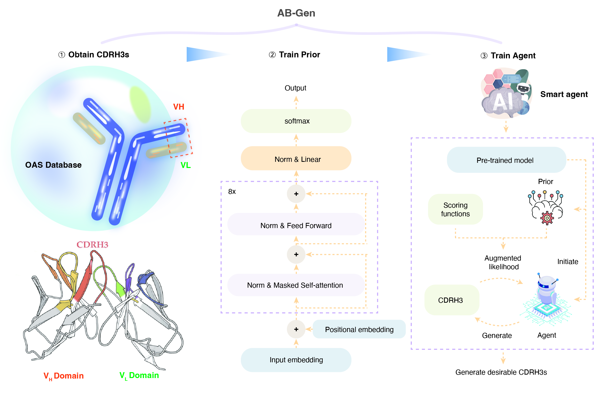

# Antibody library design with Transformer and Deep Reinforcement Learning
This is the source code for AB-Gen, a tool for antibody library design. It can efficiently explore the antibody space and design CDRH3 sequences that fulfill multi-property constraints.



## Installation
### Clone the repository
```commandline
git clone git@github.com:charlesxu90/ab-gen.git
cd ab-gen
```
### Create environment
```commandline
conda env create -f environment.yml
conda activate ab-env
```
### Download dataset and pretrained models
```commandline
git lfs pull
```
### Install netMHCIIpan
1. Download NetMHCIIpan 4.1 as shown in [the guide](https://services.healthtech.dtu.dk/service.php?NetMHCIIpan-4.0).
2. Modify `NMHOME` in `/netMHCIIpan-4.1/netMHCIIpan` file to be your unzipped folder, e.g.
```commandline
setenv	NMHOME	~/Desktop/netMHCIIpan-4.1
```
Test if netMHCIIpan-4.1 works properly:
```commandline
python -m agent.scoring.MHCAffinity
```

## Running the code
### Generate from pretrained models
```commandline
# Prior model
python generate.py --model_path data/models/Prior_10_1.704.pt --out_file result/prior/10k_samples.txt

# Agent HER2 model
python generate.py --model_path data/models/Agent_her2_final.pt --out_file result/agent/agent_oas_her2/10k_samples.txt

# Agent MPO model
python generate.py --model_path data/models/Agent_mpo_final.pt --out_file result/agent/agent_oas_mpo/10k_samples.txt

```
### Reproduce the figures
Run `jupyter-lab` in command line. Then open each jupyter notebook to reproduce the figures.

## License
This code is licensed under [Creative Commons Zero v1.0 Universal License](./LICENSE).
